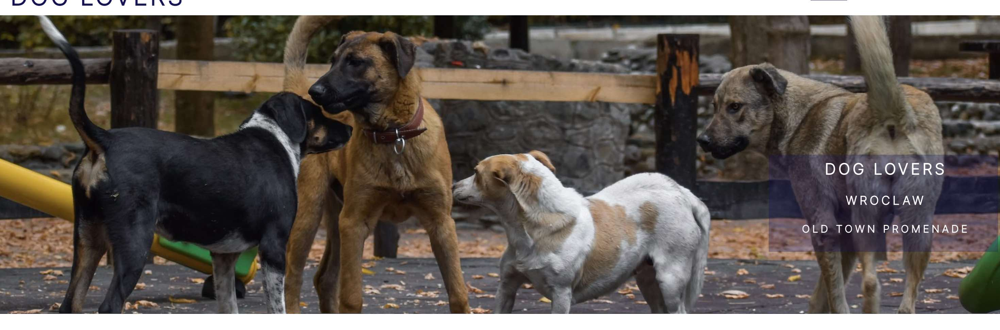
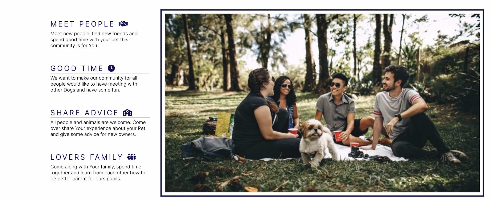
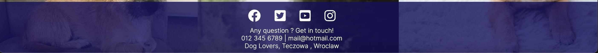
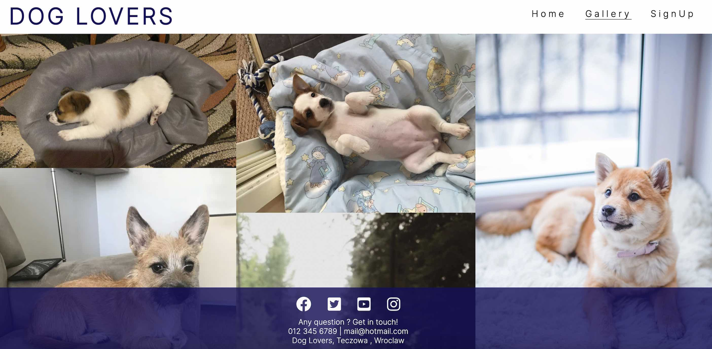
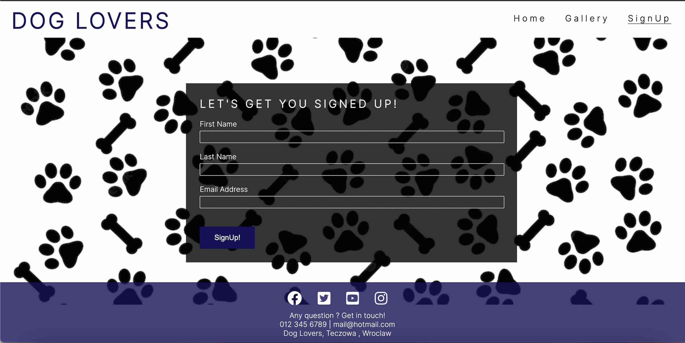
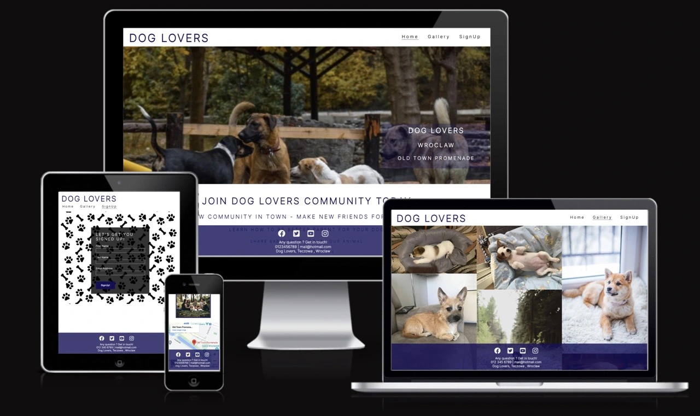
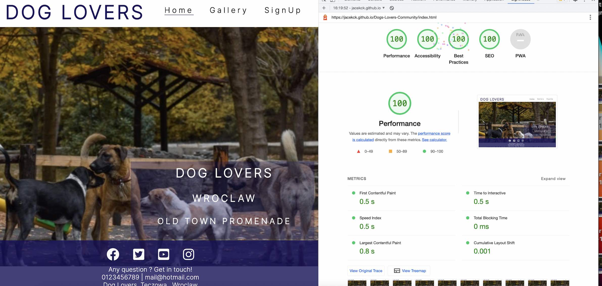

# Dog Lovers

Dog Lovers it is a website that gives you the opportunity to meet in your area and build a new community of people who love dogs in Wroclaw, Poland. 
The website will be aimed at people who want to join the new community of dog lovers in the city. Build a new community in the city where you can meet people and friends for your dog. 

## Features 

The guiding principle of our community is good for our pets. Let people remember that animals are not toys, they also have feelings and to be against any kind of violence against our animals. We need to talk about it out loud so that everyone knows it's wrong.

### Existing Features

- __Navigation Bar__*

  - Featured on all three pages, the full responsive navigation bar includes links to the Logo, Home page, Gallery and Sign Up page and is identical in each page to allow for easy navigation.
  - This section will allow the user to easily navigate from page to page across all devices without having to revert back to the previous page via the ‘back’ button. 

  *(above --> text and layout has been taken from love running project)

- __The Main page image and About Us section__

- Main page includes a photo with dogs and a location that could be our main meeting place. 
  - This section introduces the user to Dog Lovers with an eye catching animation to grab their attention.

  - Section below Main page image is about us section with simple information - why to join our community with "h1,h2" etc. element to make new user attention what they can expect, earn and get when they join our community.
  - this section includes left heading with all benefits what we can get when you join our community.
  - on the other side hava a picture how we can enjoy togheter with our animal.

- __Meetup Times section__

  - look at Features Left to Implement.

- __The Footer__ 

  - The footer section includes links to the relevant social media sites for Dog Lovers. The links will open to a new tab to allow easy navigation for the user. 
  - also footer have a contact details inlcuded and positon is fixed to webpage so is visible all the time for new users. 

- __Gallery__

  - The gallery will provide the user with supporting images to see what the meet ups look like. 

  Source of images is take from www.pexels.com and from my own libary. 
   

- __The Sign Up Page__

  - This page will allow the user to get signed up to Dog Lovers to start their journey with the community. The user will be asked to submit their first name, last name and email address. After signed up welcome pack will be sent for new joiners.

In addition, you may also use this section to discuss plans for additional features to be implemented in the future:

### Features Left to Implement

- site will be updated - when community grow up. I will add meetup section with times and location. any suggestions will be appreciate :-).

# Testing 

- Site has been check on https://ui.dev/amiresponsive to make sure is fully responsive on all devices. Have a look at picture below. 

## Lighthouse Test Perfomance

### Validator Testing 

- HTML
  - No errors were returned when passing through the official [W3C validator](assets/read-me-images/htmlvalidator.jpg)
- CSS
  - No errors were found when passing through the official [(Jigsaw) validator](assets/read-me-images/cssvalidator.jpg)

## Deployment

This section should describe the process you went through to deploy the project to a hosting platform (e.g. GitHub) 

- The site was deployed to GitHub pages. The steps to deploy are as follows: 
  - In the GitHub repository, navigate to the Settings tab 
  - From the source section drop-down menu, select the Master Branch
  - Once the master branch has been selected, the page will be automatically refreshed with a detailed ribbon display to indicate the successful deployment. 

- The live link can be found here - [Dog Lovers](https://jacekck.github.io/Dogs-Lovers-Community/index.html)

## Credits 

 - The layout of the website and the style were made on the basis of Coffeehouse Coders and Love Running by code institute. 

 - The text for the Deployment was taken from love running readme file.

### Content 

- The icons for this page were taken from [Font Awesome](https://fontawesome.com/)

### Media

- Images in main , gallery, signup page were taken from [Pexels] (https://pexels.com/)

- some Images in gallery were taken from my own libary.

 Hopefully this readme file make sense and will be helpfulf for others. Thanks everyone.

